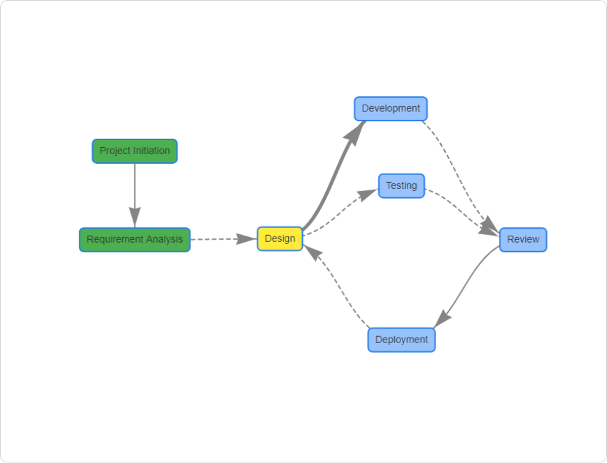

# Rulegraph Assistant
## Overview

The Rulegraph Assistant is a flexible tool designed for visualizing pipeline or workflow graphs, akin to Snakemake's DAG plots. It allows users to interactively define relationships between steps, visualize workflows, and manipulate them directly in Notion. This tool is ideal for creating and managing complex workflows with clarity.

### Features
1. Add Steps: Create steps with custom names and statuses (e.g., Not Started, In Progress, Completed).
2. Relationship Management: Define relationships between steps using various line styles and colors (solid, dashed, thick, blue arrows, red arrows, etc.).
3. Graph Editing: Edit or remove existing relationships between steps interactively.
4. Undo & Clear: Undo the last step added or clear the entire graph with ease.
5. Save as PNG: Capture and download the graph as a .png file.
6. Responsive Design: Adapts seamlessly to different screen sizes, ensuring an optimal user experience on any device.
7. Custom Suggestions: Get auto-suggestions for dependencies based on previously added steps.

### Required Libraries:
vis.js for graph visualization.
html2canvas for saving the graph as a .png.
